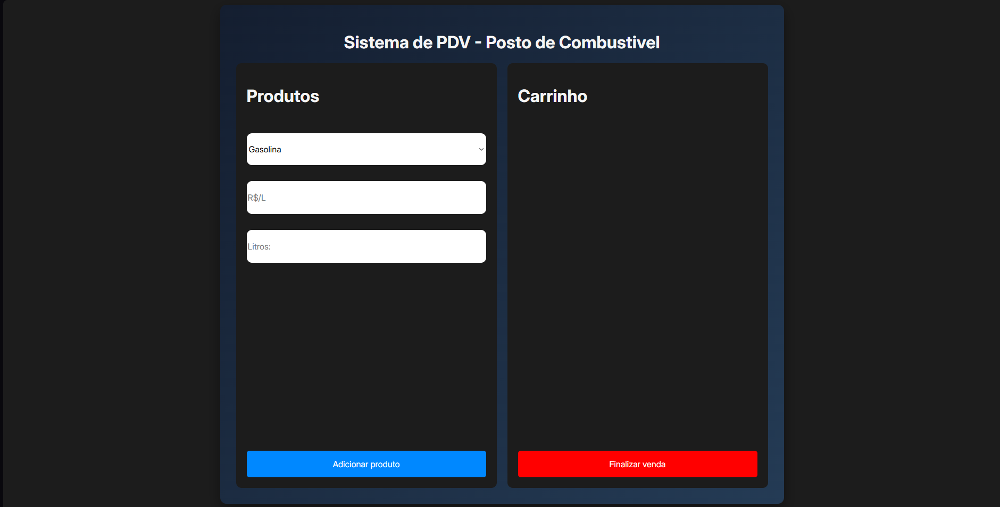
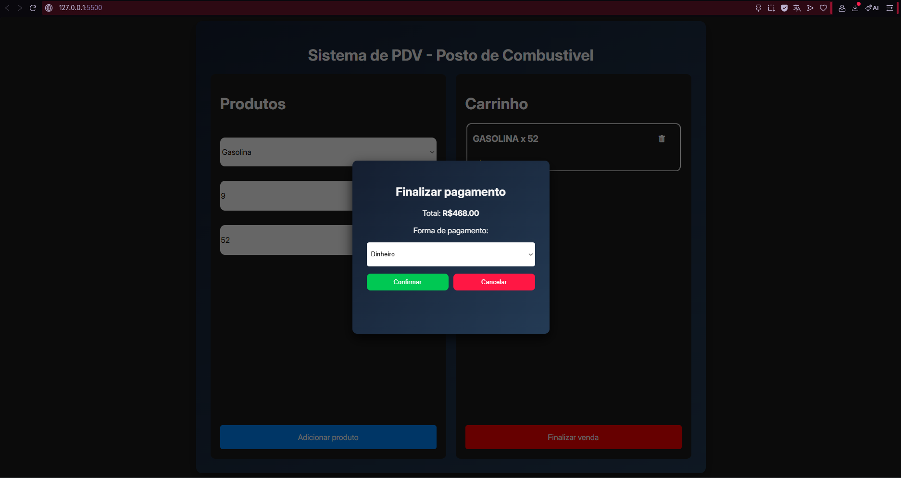

# Sistema de PDV - Posto de Combustível

Projeto simples de **Ponto de Venda (PDV)** desenvolvido com **HTML, CSS
e JavaScript puro**, com o objetivo de praticar lógica de programação,
manipulação de DOM e uso do `localStorage`.

## Funcionalidades

-   Adicionar produtos ao carrinho
-   Definir nome, preço e quantidade
-   Exibir total por item
-   Remover produtos do carrinho
-   Armazenamento automático no `localStorage`
-   Popup para finalizar pagamento
-   Limpeza automática do carrinho após pagamento

## Tecnologias utilizadas

-   HTML5
-   CSS3
-   JavaScript (Vanilla JS)
-   LocalStorage (armazenamento no navegador)

## Estrutura do projeto

    /projeto-pdv
    │
    ├── index.html      # Estrutura da interface
    ├── style.css       # Estilos do sistema
    ├── script.js       # Lógica principal
    └── product.js      # Classe de produto

## Como executar o projeto

1.  Baixe ou clone este repositório.
2.  Abra a pasta do projeto.
3.  Dê dois cliques no arquivo **index.html**.

O sistema abrirá diretamente no navegador.

Ou use o link de teste:
https://pdv-posto.onrender.com

## Como usar

1.  Digite o nome do produto.
2.  Informe o valor.
3.  Defina a quantidade.
4.  Clique em **Adicionar produto**.
5.  Quando terminar, clique em **Finalizar venda**.
6.  Escolha a forma de pagamento e confirme.

## Objetivo do projeto

Este projeto foi criado para fins de estudo, com foco em:

-   Manipulação de elementos HTML com JavaScript
-   Estruturação de lógica de carrinho de compras
-   Persistência de dados no navegador
-   Organização de código em módulos

## Screenshots

## Possíveis melhorias futuras

-   Cálculo automático de troco
-   Integração com banco de dados
-   Sistema de estoque
-   Login de usuários
-   Impressão de recibo
-   Versão em React

------------------------------------------------------------------------

Projeto educacional para prática de desenvolvimento web.
